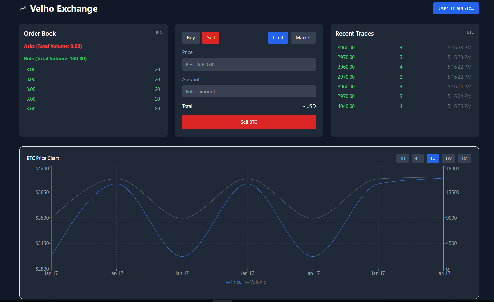
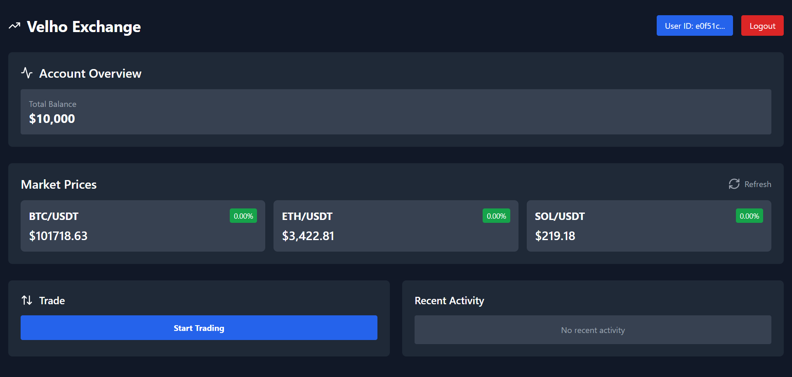

# Velho Frontend

Welcome to the Velho Frontend repository! This project serves as the frontend for Velho, a cryptocurrency exchange (CEX). The backend of Velho is built using Golang.

## Description

Velho Frontend provides a user-friendly interface for interacting with the Velho CEX. It allows users to perform various cryptocurrency transactions, view market data, and manage their accounts.

## Features

- User-friendly interface
- Secure authentication and authorization
- Real-time market data
- Seamless integration with the Velho backend

## Getting Started

To get started with Velho Frontend, follow these steps:

1. Clone the repository: `git clone https://github.com/your-username/velho-frontend.git`
2. Install the necessary dependencies: `npm install`. Do `--force` if there is some dependency issue.
3. Start the development server: `npm start`

Make sure to also set up and run the Velho backend. You can find the backend repository [here](https://github.com/your-username/velho-backend).

## Screenshots

The screenshots above showcase the user interface of the Velho Frontend. They provide a glimpse of the various features and functionalities available in the application.

Feel free to explore the app and experience the seamless integration with the Velho backend.

## Contributing

We welcome contributions to Velho Frontend! If you would like to contribute, please follow these guidelines:

1. Fork the repository
2. Create a new branch for your feature or bug fix
3. Commit your changes and push to your forked repository
4. Submit a pull request

## Credits

This project is built upon the Velho backend, which you can find [here](https://github.com/EggsyOnCode/velho-exchange).

## License

This project is licensed under the [MIT License](LICENSE).
